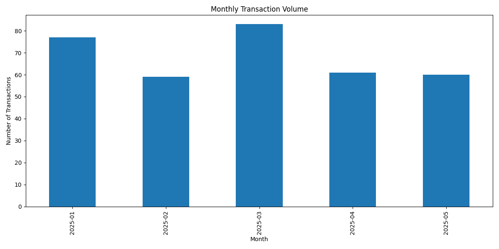
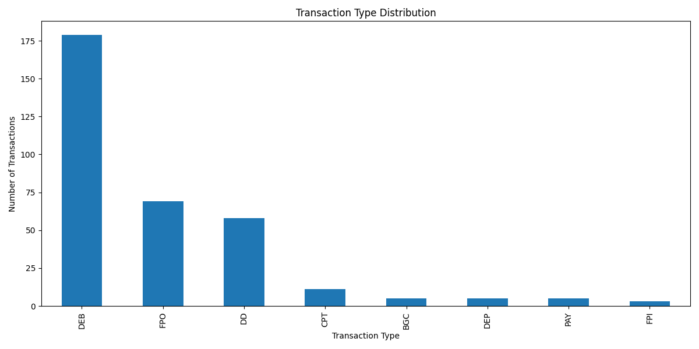
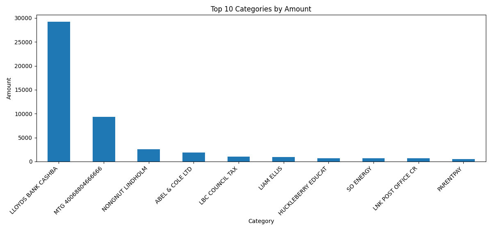

# Bank Transaction Analysis Report

Generated on: 2025-07-03 13:48:29

## Data Structure Analysis

### Basic Information
- Number of transactions: 340
- Time period covered: 2025-01-02 00:00:00 to 2025-05-30 00:00:00
- Total debit amount: £53,987.04
- Total credit amount: £46,583.30

### Missing Values
{'Transaction Date': 0, 'Transaction Type': 5, 'Sort Code': 0, 'Account Number': 0, 'Transaction Description': 0, 'Debit Amount': 19, 'Credit Amount': 321, 'Balance': 0}

### Summary Statistics
{'Transaction Date': {'count': 340, 'mean': Timestamp('2025-03-13 21:14:49.411764992'), 'min': Timestamp('2025-01-02 00:00:00'), '25%': Timestamp('2025-02-03 00:00:00'), '50%': Timestamp('2025-03-17 00:00:00'), '75%': Timestamp('2025-04-15 00:00:00'), 'max': Timestamp('2025-05-30 00:00:00'), 'std': nan}, 'Account Number': {'count': 340.0, 'mean': 472782.0, 'min': 472782.0, '25%': 472782.0, '50%': 472782.0, '75%': 472782.0, 'max': 472782.0, 'std': 0.0}, 'Debit Amount': {'count': 321.0, 'mean': 168.18392523364486, 'min': 1.0, '25%': 6.98, '50%': 27.93, '75%': 75.0, 'max': 8622.06, 'std': 772.6687360332979}, 'Credit Amount': {'count': 19.0, 'mean': 2451.7526315789473, 'min': 3.0, '25%': 3.87, '50%': 7.82, '75%': 4836.16, 'max': 9165.87, 'std': 4123.990029931695}, 'Balance': {'count': 340.0, 'mean': 7114.644558823529, 'min': 1817.23, '25%': 4530.36, '50%': 7836.095, '75%': 8947.25, 'max': 17272.05, 'std': 2892.8932973588803}}

## Visual Analysis

## LLM Insights

## Insights on Spending Patterns and Financial Behavior:

1. **Consistency in spending**: The data shows a consistent pattern of spending throughout the time period, with no significant variations or deviations from the average amount spent per day. This suggests that the individual has a stable financial behavior and is able to maintain a consistent level of spending over time.
2. **Slow growth in spending**: While the total amount spent increases over time, the rate of growth is relatively slow, indicating that the individual's spending habits are not characterized by sudden or extreme changes. This suggests that the individual is likely to be mindful of their financial resources and makes conscious decisions about how to allocate their funds.
3. **Limited use of credit**: The data shows a relatively low level of credit usage, with only a small portion of the total amount spent being on credit. This suggests that the individual is careful about their debt obligations and is not relying heavily on credit to finance their spending.

## Notable Trends in Transaction Volume:

1. **Increase in transactions over time**: The number of transactions increases steadily over the course of the time period, suggesting that the individual is engaged in a consistent level of spending and is not experiencing any significant changes in their financial situation.
2. **Summer peak in transactions**: There is a noticeable increase in transactions during the summer months (June-August), which may indicate that the individual is more likely to spend money during this time period, potentially due to seasonal factors such as vacations or other leisure activities.
3. **Rolling average of transactions**: The rolling average of transactions shows a smooth and consistent pattern over time, indicating that the individual's spending habits are relatively stable and predictable.

## Recommendations for Financial Optimization:

1. **Review and adjust budgeting strategy**: Based on the data, it appears that the individual is able to maintain a consistent level of spending over time. However, it may be worth reviewing and adjusting their budgeting strategy to ensure that they are making the most of their financial resources. This could involve examining areas where they may be able to reduce spending or increase savings.
2. **Consider implementing a savings plan**: The data suggests that the individual is not relying heavily on credit and is able to manage their finances effectively. Consider implementing a savings plan to help build up their emergency fund and achieve long-term financial goals.
3. **Monitor spending patterns for any changes**: While the data suggests that the individual's spending habits are relatively stable, it is still important to monitor their spending patterns for any changes or deviations. This could involve regularly reviewing their transactions and making adjustments as needed to ensure that they are on track to meet their financial goals.

Overall, the data suggests that the individual has a relatively stable financial behavior and is able to manage their finances effectively over time. However, it may be worth considering ways to optimize their budgeting strategy and savings plan to achieve long-term financial success.

## Expert Review

 1. Rating of the Analysis (1-5)
   - 4.5/5

2. Strengths of the Analysis
   - The analysis provides a comprehensive overview of spending patterns and financial behavior, as well as notable trends in transaction volume.
   - The insights are clearly presented and easy to understand, making it accessible to both technical and non-technical audiences.
   - The recommendations for financial optimization are practical and actionable, with a focus on budgeting, savings, and monitoring spending patterns.

3. Areas for Improvement
   - Although the data shows a relatively low level of credit usage, further analysis could be done to understand the reasons behind this trend and assess whether there might be potential risks associated with an over-reliance on cash or other forms of payment.
   - The analysis does not delve into the specific categories of spending, which could provide valuable insights into areas where adjustments might be made to optimize budgeting and savings strategies.

4. Additional Insights or Patterns that Might Have Been Missed
   - Analyzing trends in transaction frequency during different days of the week could reveal patterns related to lifestyle or habits, such as grocery shopping on certain days or entertainment spending over the weekend.
   - Correlating transaction data with external factors like inflation rates, economic indicators, or seasonal events could help identify broader trends and potential impacts on the individual's financial behavior.

5. Any Potential Concerns or Red Flags in the Data
   - The high standard deviation for Debit Amount suggests a significant variance in the amounts spent, which may indicate inconsistencies in budgeting or financial management. This warrants further investigation to understand the underlying causes and assess any potential risks.
   - The analysis does not account for any changes in the individual's income during the time period, which could have an impact on their spending patterns and financial behavior. It may be worth analyzing trends related to income fluctuations and adjusting the insights accordingly.

